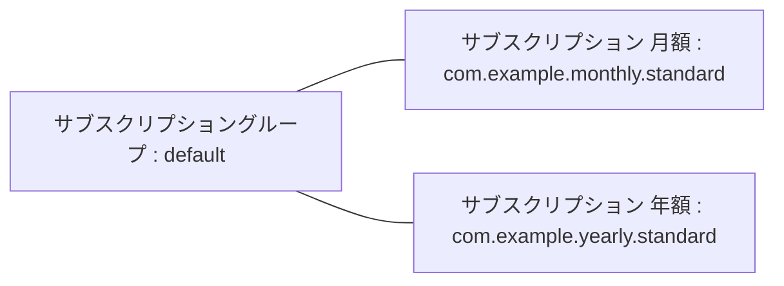
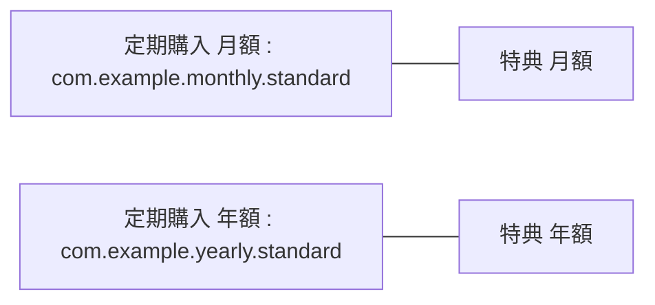

Flutter にて in_app_purchase を使って定期課金を実現するための方法をまとめました。

構成は単純な デバイス + DB 以外にも購入データを証明するバックエンドも加わり割りと複雑で、
in_app_purchase が行っている処理への理解も必要の上、Apple, Google 上で行うべき作業もある。

実際実現してみて事前にある程度情報を入れておかないと、実現するのは難しいと思ったのでまとめておく。

# 定期課金を導入したアプリ

**[フットサルSNSアプリ 「フットサルメット」][FutsalMet]**



広告なしで使える無料アプリだが機能制限があり、より便利な機能を利用するための定期課金を提供している。


# 参考にしたサイト

理解をするのに助けてもらったサイト。2023年9月においては古い情報もあり、完全に網羅しているサイトはかなった。
これを読めば大丈夫。というものがなく、複数のサイトからの情報とトライアンドエラーが必要だったので、
今回まとめようと思ったモチベーションになっている。



必要な処理ごとにフローとサンプルコードを示しているので、どんな処理が必要なのか理解できる。
示しているソースコードは実際の処理としては足りないので、鵜呑みにしない方が良い。

{% linkpreview "https://qiita.com/YuKiO-OO/items/a0fe8e0a256afbb69fc7#%E5%B0%8E%E5%85%A5%E3%81%99%E3%82%8B%E3%83%91%E3%83%83%E3%82%B1%E3%83%BC%E3%82%B8" %}

大まかに必要な要素をカバーしている。全体の流れを網羅するには良い。
示しているソースコードは現状にはない関数があったり、かなり省略されているので実際のコードとしてはあまり参考にならない。



購入した際に発行されるレシートの検証処理についてまとめている。
検証するための構成や検証処理への理解を深められる。
示しているソースコードはどんな処理をすればよいのか理解はできるが、サーバ側の検証部分が一部省略されているので、鵜呑みにしない方が良い。


# 目次

<!-- TOC -->
* [環境](#環境)
* [構成](#構成)
* [準備](#準備)
* [Flutter 側セットアップ](#flutter-側セットアップ)
* [アイテム登録](#アイテム登録)
  * [iOS](#ios)
  * [Android](#android)
* [実装](#実装)
  * [基本的な処理の流れ](#基本的な処理の流れ)
  * [検証 verify とは](#検証-verify-とは)
  * [仕様](#仕様)
  * [firebase functions](#firebase-functions)
    * [verify](#verify)
    * [verifySubscription](#verifysubscription)
    * [verifyReceipt](#verifyreceipt)
  * [in_app_purchase](#inapppurchase)
    * [注意点](#注意点-2)
    * [Sample Code](#sample-code)
  * [リストア restore](#リストア-restore)
* [テスト](#テスト)
  * [デバイス](#デバイス)
    * [iOS](#ios-1)
    * [Android](#android-1)
  * [定期課金処理](#定期課金処理)
  * [定期課金の解約](#定期課金の解約)
    * [iOS](#ios-2)
    * [Android](#android-2)
* [審査](#審査)
  * [iOS](#ios-3)
  * [Android](#android-3)
* [まとめ](#まとめ)
<!-- TOC -->

# 環境

- Flutter 3.13.4
- Dart 3.1.2
- [in_app_purchase][in_app_purchase] 3.1.8
  
[in_app_purchase]: https://github.com/flutter/packages/tree/main/packages/in_app_purchase/in_app_purchase

# 構成

- Flutter : アプリUIの提供。バックエンドとの通信
- in_app_purchase : アプリ内課金を実現する。iOS, Android アイテム情報の取得、購入処理を行う
- Firebase Firestore Database : DB として利用するバックエンド
- Firebase Functions : Node.js で動かすバックエンド。今回は購入後のレシート情報の検証と firestore への書き込みを行う

# 準備

1. Flutter 側のセットアップ in_app_purchase 導入
2. iOS, Android へのアイテム登録


# Flutter 側セットアップ

[in_app_purchase の README][in_app_purchase] の Getting started にも示されている通り、
[codelab][codelab] に沿うのが一番良いと思う。ただし、すべてのスッテップを行うのではなく「6. Set up Firebase」 まででOK。
その後の実装はバックエンドに dart で書いたサーバを立てる想定なので、今回の構成とマッチしなくなるので、参考にしない。

# アイテム登録

[codelab][codelab] の「Set up the App Store」、「Set up the Play Store」の通りにする。

今回は、有料サービスの内容は1つだけど、月額、年額と2つの購入方法を用意する。

ここでは product id は以下のようにする。

1. 月額 : com.example.monthly.standard
2. 年額 : com.example.yearly.standard

flutter in_app_purchase 上の product id は、以下に対応する。

- iOS : サブスクリプションの製品ID
- Android : 定期課金のアイテムID

## iOS

[App Store Connect][App Store Connect] の該当アプリ上の「サブスクリプション」で入力する。

「サブスクリプション」が実際のユーザーに提示する課金アイテム。それらをまとめるための「サブスクリプショングループ」がある。
今回のように、同じサービス内容で複数の支払方法に対応したい場合は、1つのサブスクリプショングループでまとめることができる。

サブスクリプショングループを1つ作り、その配下にサブスクリプションを追加した。




サブスクリプションには製品IDを付与して、これが flutter 上で持っておく product id になる。

### 注意点

[App Store Connect][App Store Connect] で各サブスクリプションを入力する際に、最下部にある「審査に関する情報」でスクリーンショットと審査メモを必ず登録すること。
この情報がなくても保存して審査へ提出ができるが、審査でリジェクトされる。

スクリーンショットは、そのサブスクリプションを購入する画面にした。
審査メモは、その画面に行き着くフローを示した。結果的に承認されたので、この内容で良いと思う。

実際には以下のようにした。


## Android

[Google Play Console][Google Play Console] の該当アプリ上の「収益化」-「定期購入」にて入力する。

「定期購入」がアイテムIDを持ち、支払いサイクルなどを設定できる「特典」を配下に紐付ける。
`queryProductDetails` した時の product id は特典ではなく定期購入のアイテムIDになるので、
定期購入を複数作成するようにする。特典を指定する方法は分からなかった。



### 注意点

注意点1 : 定期課金と特典は削除できないので不要なものが残ってしまう。

また、`queryProductDetails` する時に不要なものを配列に入れなかったら `notFoundIDs` が返ってくる。
**不要なアイテムIDも含めたすべての定期課金のアイテムIDの配列にする必要がある。**

注意点2 : 定期購入をテストで使いたい場合は事前にビルドしたアプリをアップロードする必要がある。

この時点では課金の実装はできていないが、紐付ける App Bundle が必要なので、現状のアプリをとりあえずビルドしてアップロードすれば良い。
App Bundle エクスプローラに表示されサブスクリプションの画面にて紐付けられればOK。くれぐれも公開しないこと。


# 実装

## 基本的な処理の流れ

ユースケースごとに示す。

**新規購入**
1. デバイス(flutter)にて購入処理、Apple, Google へ問い合わせて購入処理をして localVerificationData を受け取る
2. firebase functions にて localVerificationData を使って Apple, Google へ検証する。最近のレシートを受け取る
3. firebase functions にて最近のレシート情報を firestore に保存する
4. flutter にて購入完了処理(購入ボタンの widget を閉じるなど)

**定期課金更新チェック** (firebase functions のみで実行)
1. firebase functions を cron 的に毎日スケジュールで実行
2. firebase firestore に存在するレシート情報から有効期限が切れているものを検索
3. 該当レシートの verificationData を使って Apple, Google へ検証する。最新のレシートを受け取る
4. 最新のレシートの有効期限が今よりも後ならば、最近のレシート情報を firestore に保存する

**ユーザーが有料ユーザーかどうか判別** (flutter アプリにて)
1. firebase auth ユーザー情報より、該当ユーザーの firebase firestore 上のレシート情報のドキュメントを検索
2. 該当ドキュメントの有効期限が現在時刻よりも後ならば有料ユーザー true, 前なら false

**リストア** (flutter アプリにて)
1. flutter 上は有料ユーザーではないと判別(firestore 上に有効期限内のレシート情報がない)
2. ユーザーがリストアボタンを押す
3. firebase functions にて localVerificationData を使って Apple, Google へ検証する。最近のレシートを受け取る
4. firebase functions にて最近のレシート情報を firestore に保存する

## 検証 verify とは

お金に絡むことなので、誤ったデータを使って購入させたり不正を防止するために Apple, Google が設けている購入したレシート情報の検証を行う処理。
1回毎の支払い情報のことをレシートと呼ぶ。

Apple, Google ともにレシート情報を返す Web Endpoint を設けている。 

- Apple : [verifyReceipt][verifyreceipt]
- Google : [purchases.subscriptions.get][purchases.subscriptions.get]

クライアント(今回はflutter)にて Apple(App Store), Google(Google Play) を使って購入処理をすると verificationData が発行される。
そのデータを Apple, Google の 検証用 endpoint へ問い合わせて検証結果がOKなら、最新のレシート情報(last receipt) が返ってくる。

このデータが有料ユーザーの判別に使えるので firestore に保存している。

<div class="alert alert-warning" role="alert" xmlns="http://www.w3.org/1999/html">
  <div style="float: left; margin-right: 10px;">
    <i class="fas fa-info-circle fa-lg"></i>
  </div>
  <div>
    <a href="https://developer.apple.com/documentation/appstorereceipts/verifyreceipt">
        Apple の verifyReceipt endpoint は非推奨(Deprecated)になった
    </a>
    ので推奨方法での切り替えが必要。
    App Store Server API を使うようにとのこと
  </div>
</div>

## 仕様

- 有料ユーザーかどうかのチェックは1日1回とする
- レシート情報の有効期限内なら有料ユーザーと判別する
- flutter(クライアント側)では定期的に狙ったタイミングではチェックできないので、firebase functions にて行う
- 最新のレシート情報は firebase firestore に保存し、有料ユーザーの判別に使う

## firebase functions

主に参考にさせてもらったサイト 特に返り値の部分とか踏襲している。


3種類の関数を設けた。

1. verify :  flutter からの verify チェックのリクエストの窓口用
2. verifyReceipt : Apple, Google にアクセスし、レシートデータを検証して、latest_receipt(最新のレシート)情報を返し、firestore に保存する
3. verifySubscription : 定期購入の更新をチェックし、latest_receipt(最新レシート)を firestore に保存する

検証にアクセスする Apple, Google のURLやレスポンが異なっているので、 iOS, Android 用に2種類ずつ必要。
計6つの関数を設けている。

1. verify
   1. verifyIos
   2. verifyAndroid
2. verifyReceipt
   1. verifyReceiptIos
   2. verifyReceiptAndroid
3. verifySubscription
   1. verifySubscriptionIos
   2. verifySubscriptionAndroid

関数ごとに分けて解説する。
functions にデプロイするファイル(今回は purchase.js)の先頭には以下のようにしている。

```javascript
const functions = require('firebase-functions');
const admin = require('firebase-admin');
const axios = require('axios');
const { google } = require('googleapis');
const { Firestore } = require("firebase-admin/firestore");
```

各関数の返り値は以下のようにファイル内で定義している。flutter 側でも同じ用に解釈できるようにしている。

```javascript
const SUCCESS = 0; // 成功
const EXPIRED = 1; // 期限切れ
const DOCUMENT_NOT_FOUND = 2; // Firestoreにドキュメントなし
const NO_AUTH = 3; // 認証情報なし
const INVALID_RECEIPT = 4; // レシート情報が不正です
const ALREADY_EXIST = 5; // 同じトランザクションが存在している
const UNEXPECTED_ERROR = 99; // 不明なエラー
```
### verify

`verifyIos` を例に解説する。



[verifyAndroid の gist はこちら](https://gist.github.com/d-sea/08e0f8973b94008c0e93c828b1634dbc)

`http.onCall` で HTTP で受け付ける。`context.auth` で認証ユーザーであることが必須。

flutter 側から `data["data"]` に入っている `verificationData` を受け取る。

後述する `verifyReceipt` に `verificationData` を渡して最新のレシート `latestReceipt` を受け取る。

`latestReceipt` の `transaction_id` は支払処理ごとに割り当てられるユニークなIDなので、
すでに firestore に保存されていないか確認する。
firebase auth のユーザーが異なっていている場合もあるので、`collectionGroup` で検索している。

なければ firestore に保存する。
検証に利用するだけならカラムはもっと減らせるが、
問い合わせなどがあった場合に運営側として把握しておきたい情報も含めている。
実際保存しているカラムの意味は以下。

iOSの場合

- receipt_data : verificationData をそのまま格納、verificationData は課金が続く限り認証情報として利用される
- product_id : 購入した製品ID,アイテムID
- transaction_id : 購入処理ごとに割り当てられたユニークなID
- purchase_date_ms : 購入日時の unix time のミリセカンド
- purchase_date : 購入日時
- expires_date_ms : この購入の期限日時の unix time のミリセカンド
- expires_date : この購入の期限日時

`verifyAndroid` のAndroidの場合は以下。
`transaction_id` の代わりに `orderId` になる。

- receipt_data : verificationData をそのまま格納、verificationData は課金が続く限り認証情報として利用される
- product_id : 購入した製品ID,アイテムID
- orderId : 購入処理ごとに割り当てられたユニークなID
- purchase_date_ms : 購入日時の unix time のミリセカンド
- purchase_date : 購入日時
- expires_date_ms : この購入の期限日時の unix time のミリセカンド
- expires_date : この購入の期限日時

最後に期限日時が現在時刻と比較して期限が切れていないかどうかチェック。その結果を返す。

### verifySubscription

`verifySubscriptionIos` を例に解説する。



[verifySubscriptionAndroid の gist はこちら](https://gist.github.com/d-sea/3c06862355657a358916b898e5110bec)

`pubsub.schedule` にて定期実行させる。1日1回夜中に実行。

レシート情報から有効期限が切れているものを見つける。実行間隔は24時間なので、その間隔で検索する。

レシート情報の `receipt_data` を使って、`verifyReceiptIos` へ検証してもらう。

`latestReceipt` があり、有効期限が現在以降ならレシート情報を firestore に保存する。

Android 版の `verifySubscriptionAndroid` はfirestore の保存カラムが異なるだけで、処理内容は同じ。

### verifyReceipt



[verifyReceiptAndroid の gist はこちら](https://gist.github.com/d-sea/d0b412c76977b161715adc568111e4f9)

`verificationData` を使って、Apple の [verifyReceipt][verifyreceipt] にある `Latest_receipt_info` にアクスする。

レスポンスを見て、最終購入のレシート情報 `latest_receipt` を返す。

latest_receipt のレスポンスの各プロパティーの意味はドキュメントを参照

- Apple : [App Store Receipts responseBody.Latest_receipt_info](https://developer.apple.com/documentation/appstorereceipts/responsebody/latest_receipt_info)
- Google : [Google Play Developer API SubscriptionPurchase](https://developers.google.com/android-publisher/api-ref/rest/v3/purchases.subscriptions?hl=ja#SubscriptionPurchase)

Apple, Google にアクセスするためには認証情報が必要。

- Apple : RECEIPT_VERIFICATION_PASSWORD_FOR_IOS
- Google
  - SERVICE_CLIENT_EMAIL_FOR_ANDROID
  - SERVICE_PRIVATE_KEY_FOR_ANDROID

`RECEIPT_VERIFICATION_PASSWORD_FOR_IOS` は、 [App Store Connect][App Store Connect] で確認できる。

`App Store Connect > ユーザーとアクセス > 共有シークレット`

ない場合は生成する。

生成した共有シークレットの値をコード内の `RECEIPT_VERIFICATION_PASSWORD_FOR_IOS` の値に定義する。

`SERVICE_CLIENT_EMAIL_FOR_ANDROID`, `SERVICE_PRIVATE_KEY_FOR_ANDROID` は Google Cloud でアプリのプロジェクトにリンクした
サービスアカウントを作成する必要がある。

やり方は、
[Google Play Developer API](https://developers.google.com/android-publisher/getting_started?hl=ja)
にありますが、執筆時点で Google Play Console の APIアクセスページが廃止されている。

[Google Cloud のコンソール画面](https://console.cloud.google.com/)から行う必要がありそう。

`Google Cloud > IAM と管理 > サービスアカウント` でたどれる。

設定方法は、以下のサイトが参考になる。

[Google Play Store向けサービスアカウントの作り方](https://zenn.dev/altiveinc/articles/how-to-google-service-account#%E3%82%B5%E3%83%BC%E3%83%93%E3%82%B9%E3%82%A2%E3%82%AB%E3%82%A6%E3%83%B3%E3%83%88%E3%81%AE%E4%BD%9C%E6%88%90)

このドキュメントの「秘密鍵の作成とJSONダウンロード」で、JSON を保存しますが、このJSONファイルに記載されている、
`client_email`, `private_key` をそれぞれ、コード内の 
`SERVICE_CLIENT_EMAIL_FOR_ANDROID`, `SERVICE_PRIVATE_KEY_FOR_ANDROID` の値に定義する。 


## in_app_purchase

flutter 公式の in app purchase するためのパッケージ。

実装の構成としては、以下の3つ。

1. 利用可能かどうか確認する : `isAvailable()` 
2. 販売する product の提示 : `queryProductDetails` を使って情報を widget に表示
3. 購入状況を把握する : `purchaseStream` 公式のように listener として状態を監視する

購入処理の流れとしては、

1. 有料サービス説明と購入ボタンを含む widget を表示 `queryProductDetails` の情報を提示
2. 購入ボタンをユーザーが押す
3. listener が動き出す
4. ユーザーが in app purchase 画面で購入処理をする
5. listener が status == purchased を検出
6. 有料サービスの widget を閉じて、有料サービスを提供する

### 注意点

in app purchase で購入せずキャンセルして画面を閉じた場合は、
処理が完了せずに `purchaseDetails.pendingCompletePurchase == ture` となる。
この状態で再び購入ボタンを押すと、すでに listener 上であるのでエラーになる。
そのため、この状態になったら listener 上で `completePurchase` して残らないようにしている。

### Sample Code

購入するための widget。購入ボタンを押した後のレシートの検証も含めた1つのファイルにまとめている。



StatefulWidget にしている。

`initState()` で `_getProducts()` してアイテム情報を取得し、listener の設定をする。

**購入アイテムの表示**

`_getProducts()` では `queryProductDetails` して、返り値を `ProductDetails` の配列 `_products` に入れる。

`_products` の情報より widget を表示させる。
`ProductDetails` は、以下の情報を使って購入ボタンを表示している。

- id : ex. com.example.monthly.standard
- price : 通貨表示を含めた国ごとの価格
- description : アイテム登録時に入力した説明文

**購入処理**

購入ボタンを押して `buyNonConsumable` を走らせると、 listener `_listenToPurchaseUpdated` が動き出す。

listener の status の状況によって処理を分ける。status が `purchased`,`restored` になったら
`_verifyPurchase` で検証を走らせる。

`_verifyPurchase` では `FirebaseFunctions.instance.httpsCallable('verifyIos')` のように
firebase functions へ http アクセスをして返り値を得て、そのまま値を返す。

返ってきた値によって `_listenToPurchaseUpdated` が処理を分ける。

`BillingConst.SUCCESS` だった場合 `deliverProduct` して、購入画面の widget を閉じて購入処理が完了する。


## リストア restore

リストは  iOS の審査には必須。ないとリジェクトされる。

リストが発生するのは、以下のような状態。

- ユーザーは定期課金契約中、支払いは継続している、解約していない
- ユーザー情報からは支払い履歴が確認できない

処理としては、verify で確認して、OKなら firestore に書き込む。

コードとしては、リストアするボタンを以下のようにすれば動作する。

```dart
CupertinoButton.filled(
  child: Text('リストアする'),
  onPressed: () {
    try {
      await inAppPurchase.restorePurchases();
    } catch(error) {
      print('inAppPurchase.restorePurchase: $error');
    }
  },
);
```

listener などはそのまま利用する必要があるため、上記の Sample Code に `bool isRestore` のような判別を加えて、

```dart
isRestore
 ? CupertinoButton.filled(
    child: Text('リストアする'),
    onPressed: () {
      try {
        await inAppPurchase.restorePurchases();
      } catch(error) {
        print('inAppPurchase.restorePurchase: $error');
      }
    },
  )
  : CupertinoButton.filled(
      child: Text(_buttonView), 
      //
  ),
  //
```

のようにしている。

# テスト

## デバイス

###  iOS

購入テストを行うには実機が必要。iOS Simulator では購入できない。

購入テストにはテストアカウントを使う。
テストアカウントの作成は、[App Store Connect][App Store Connect] の [ユーザーとアクセスのSandboxテスター][sandbox tester] で行う。


テストアカウントを実機に設定する方法は、
[codelab][codelab] の 「Set up the App Store」 にあるように、
`Setting > App Store > Sandbox-account` にて設定する。
これで、TestFlight でアプリを配布、インストールして、テストアカウントにて購入処理ができる。


### Android

Android Emulator で購入処理ができる。ただし Play Store に対応しているデバイスであること。


購入処理を進めた際にログインが求められた時は、自身の Google アカウントを使えば良い。

## 定期課金処理

定期課金処理は Apple, Google 共に数分間隔で実行される。(実際に1ヶ月や1年待つ訳に行かないので)

- iOS : 特に通知なし、一定回数になると課金処理が停止されるが、定期課金の解約処理はされない
- Android : 課金されるたびに都度メールが来る。このメール内に解約処理など manage できるページへのリンクが表示されている


## 定期課金の解約

実際はテストで新規購入のケースを何度も行いたい場合に定期課金の解約を行いたい時がある。
テスト環境での定期課金の解約方法を知っておく必要がある。

### iOS

テストアカウントの作成は、[App Store Connect][App Store Connect] の [ユーザーとアクセスのSandboxテスター][sandbox tester] で行う。


1. Sandboxテスターのページで、テストアカウントが表示されれていることを確認して、「編集」ボタンを押す
2. 該当のテストアカウントのチェックボックスにチェックを付ける
3. すると、「購入履歴を消去」ボタンが押せるようになるので、押す

解約処理の完了は通知されない。ボタンを押してから数十分後に反映されているようなので、すぐには新規購入はできない。

### Android

ログインしたユーザーの [Google Play の定期課金][Google Play subscription] にて行える。
また、定期課金の最初の購入処理がされるとメールを受け取るので、その本文に記載されている「Manage your subscriptions」リンクからもたどれる。

定期購入の解約が完了したらメールで通知されるので、それを待って新規購入のテストが行える。

メール本文は以下。

```
Your フットサルメット subscription from Players1st, inc. on Google Play has been canceled.

Order number: GPA.3340-2542-4611-83848
Order date: Sep 19, 2023 8:44:06 AM GMT+9
```

# 審査

## iOS

上記のアイテム登録の[注意点](#注意点)で示した、スクリーンショットと審査メモが実質必須なことを押さえれば、
つまずきそうなポイントはないと思う。

今回1回リジェクトされて、App Store Connect 上の設定だけで対応できる対応内容だったが、
コード上は何も変更がないのに、新しくビルド・アップロードして新しいビルドを審査に出すバージョンに紐付けなおす必要があった。

App Store Connect 上の設定だけで対応できる場合も **必ず新しいビルドを紐付ける必要がある**。

多分これは、Apple の内部の都合で、一度リジェクトなどのステータスが決定されたビルドはステータス変更できないようにしているのだと思う。
だから、再レビューするにはコードの変更がなくても新しいビルドが必要ということだろう。

あと審査は人間がアメリカのタイムゾーンで行っているようなので、日本時間のだいたい夕方から明け方に稼働してレスポンスが来る。
だから、朝イチでレビュー依頼しても夕方以降までは何も起きない。
変更を行ってから寝ている間に対応さしてくれるくらい時間がかかるものだと認識しておくと良い。

## Android

製品版で新しいリリースを作成してあらかじめ作成していた定期購入を紐付ければ、特に気をつけるポイントはない。

審査は、システムが自動的に行なっているようで、数時間で結果が出る。
Google Play で公開されると、
`Your update is live` という題名のシンプルなメールが届く。

# まとめ

in app purchase で定期課金を実現するには、
複数の要素や多方面の知識が必要になるため、このドキュメントも膨大な情報量になってしまいました。

ひとつずつ解消していけば確実に実現するので、
時間はかかると思うが、ぜひチャレンジしていただければと思います。

このドキュメントが誰かの役に立てば幸いです。

内容に関する、修正点の指摘、やってみたけど動かなかったなどの指摘はコメントにていただければです。

また、flutter x firebase で作るサーバーレスなアプリ開発や今回のような in app purchase の定額課金導入に対する
有料のサポートも行っています。
コンタクトフォームからお問い合わせください。


[FutsalMet]: https://company.p1st.app/futsal-met/
[codelab]: https://codelabs.developers.google.com/codelabs/flutter-in-app-purchases
[App Store Connect]: https://appstoreconnect.apple.com/
[Google Play Console]: https://play.google.com/console/
[sandbox tester]: https://appstoreconnect.apple.com/access/users/sandbox
[Google Play subscription]: https://play.google.com/store/account/subscriptions
[verifyreceipt]: https://developer.apple.com/documentation/appstorereceipts/verifyreceipt
[purchases.subscriptions.get]: https://developers.google.com/android-publisher/api-ref/rest/v3/purchases.subscriptions/get?hl=ja
